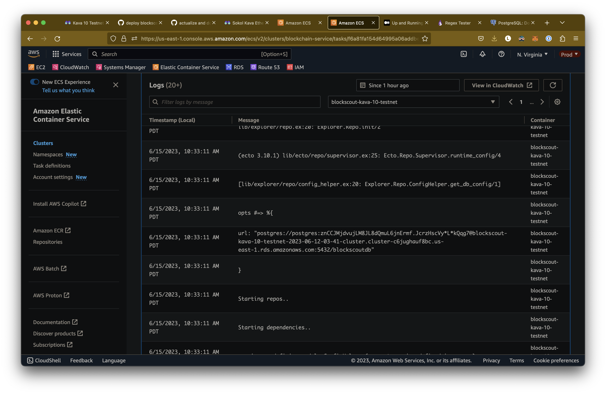

# Development

The goal of this document is to allow any developer to be able to quickly build, run, test, develop and debug a local version of the [Kava customized Blockscout Ethereum Explorer](https://explorer.kava.io).

## Setting up required toolchains

### Elixir & Phoenix

Follow [this guide](https://hexdocs.pm/phoenix/installation.html) for how to install and configure erlang, elixir and other dependencies needed by the Phoenix web framework.

### Node

[Node version file](./.node-version)

Current version used: `18.14.0`

Install required node version using a tool such as homebrew or asdf

- <https://nodejs.org/en/download/package-manager>

### Docker & Docker Compose

Install latest version of Docker and Docker compose

- [Docker](https://docs.docker.com/engine/install/) for building service docker images
- [Docker Compose (v2+)](https://docs.docker.com/compose/install/) for orchestrating containers for the service and it's dependencies (e.g. postgres database and redis cache)

## Configuration

Adjusting or setting of values to be used by `make`, `docker-compose` or any of the containerized applications is possible by modifying the [local environment file](./.env)

```bash
# used by the kava docker compose service
KAVA_CONTAINER_EVM_RPC_PORT=8545
KAVA_HOST_EVM_RPC_PORT=8545
KAVA_CONTAINER_COSMOS_RPC_PORT=26657
KAVA_HOST_COSMOS_RPC_PORT=26657

# Used by the postgres database docker file
PGTAP_VERSION=v1.2.0

# Used by the postgres database docker compose service
POSTGRES_HOST_PORT=5444
POSTGRES_CONTAINER_PORT=5432

# Used by the postgres database application
POSTGRES_ADMIN_USERNAME=postgres
POSTGRES_BLOCKSCOUT_USERNAME=blockscout_user
POSTGRES_BLOCKSCOUT_DATABASE_NAME=blockscout_testing
POSTGRES_PASSWORD=root_password123
DB_BLOCKSCOUT_PASSWORD=blockscout_password123
POSTGRES_MAX_NUM_CONNECTIONS=200

...etc...
```

## Building

Build a development version docker image of the service

```bash
make build
```

## Running

### Blockscout + Postgres + Kava

Executing the below command will build and start local versions of blockscout, postgres and kava, exposing a web UI that can be viewed by opening your browser to `http://localhost:4000`

```bash
make up
```

An example of command flow used during typical iterative development:

```bash
# start (or restart previously built) containers for all the services
# in docker-compose.yml
make up
# rebuild, reset state and restart all containers for all the services
# in docker-compose.yml
make reset
# rebuild and restart just the blockscout service
make refresh
# stop and start (without re-building or wiping state) just the proxy blockscout
make restart
# stop all services in docker-compose.yml
make down
```

other commands with comments for their purpose are available in the [Makefile](./Makefile)

### Hardhat server

```bash
npx hardhat node --hostname 0.0.0.0
```

## Testing

Running blockscout tests

```bash
mix deps.get
mix test
```

> NOTE: These currently fail, TBD on cause or resolution

## Debugging

### Blockscout

#### Print Debugging

Download the sources locally for the base version of blockscout used to build the kava customized development and production images

```bash
make vendor-blockscout
```

Add print debugging statements using `dbg` or make other desired modifications to the applications logic and state

```bash
cd blockscout/blockscout-base
```

```elixir
# CODE
  def get_db_config(opts) do
    # DEBUG
    # https://elixir-lang.org/getting-started/debugging.html
    dbg(opts)
    url_encoded = opts[:url] || System.get_env("DATABASE_URL")
    url = url_encoded && URI.decode(url_encoded)
    env_function = opts[:env_func] || (&System.get_env/1)

    @postgrex_env_vars
    |> get_env_vars(env_function)
    |> Keyword.merge(extract_parameters(url))
  end
```

Create a patch of your changes to be applied when the development or production docker image is built

```bash
git diff > ../patches/debug.patch
# repo base kava-blockscout-build/
cd ../../
# to run your debugged version of blockscout locally
make refresh
```

#### Portable Docker Dev Environment

Requires
    - vscode
    - docker

Build an image that has all elixir and node dependnecies to run the app, and all current source code and compiled assets

```bash
make local
```

run a docker container using the above image

```bash
docker run -it -d -v ./blockscout/blockscout-base:/src/blockscout  -v ./blockscout/patches:/src/patches kava-blockscout:local

# apply current patches
cd /blockscout/blockscout-base && git apply ../patches/*.patch && git add ./ && git commit -m "REVERT-ME-PATCH-COMMIT"
# REVERT this commit before pushing to origin for a PR)
```

Attach a [vs code editor dev container](https://code.visualstudio.com/docs/devcontainers/containers) to the running container (open command member, type/select Dev Containers: Attach to running container)

Now any code changes you make inside the container will be persisted on your local machine, and you can use the patch workflow below to upstream your code changes.

Create a patch of your changes to be applied when the development or production docker image is built

```bash
# from your host machine
cd /blockcout/blockscout-base
git diff > ../patches/NAME_OF_PATCH.patch
```

Some helpful commands

```bash
# from inside /src/blockscout of dev container
# fetch dependencies from all apps
mix deps.get
# compile sources for all apps (indexer, explorer)
mix compile

# if you want to just update / compile a single app, such as the indexer
# from inside /src/blockscout of dev container
cd /apps/indexer
# fetch dependencies for just this app
mix deps.get
# compile sources for just this app
mix compile
```

#### Indexer status

To see how far back the block explorer has indexed blocks, connect to the database and query to see what is the earliest block it has indexed, if these values change that means earlier and earlier blocks are being indexed (`refetch_needed` indicates whether the indexing was successful)

```sql
make debug-database
blockscout_testing=# select number, inserted_at, updated_at, refetch_needed from blocks order by number asc limit 5;
 number  |        inserted_at         |         updated_at         | refetch_needed
---------+----------------------------+----------------------------+----------------
 5762464 | 2023-06-16 00:27:58.151073 | 2023-06-16 00:27:58.151073 | f
 5762465 | 2023-06-16 00:27:58.032291 | 2023-06-16 00:27:58.032291 | f
 5762466 | 2023-06-16 00:27:57.890547 | 2023-06-16 00:27:57.890547 | f
 5762467 | 2023-06-16 00:27:57.774853 | 2023-06-16 00:27:57.774853 | f
 5762468 | 2023-06-16 00:27:57.658246 | 2023-06-16 00:27:57.658246 | f
(5 rows)

blockscout_testing=# select number, inserted_at, updated_at, refetch_needed from blocks order by number asc limit 5;
 number  |        inserted_at         |         updated_at         | refetch_needed
---------+----------------------------+----------------------------+----------------
 5762461 | 2023-06-16 00:27:58.521786 | 2023-06-16 00:27:58.521786 | f
 5762462 | 2023-06-16 00:27:58.409383 | 2023-06-16 00:27:58.409383 | f
 5762463 | 2023-06-16 00:27:58.272033 | 2023-06-16 00:27:58.272033 | f
 5762464 | 2023-06-16 00:27:58.151073 | 2023-06-16 00:27:58.151073 | f
 5762465 | 2023-06-16 00:27:58.032291 | 2023-06-16 00:27:58.032291 | f
(5 rows)

blockscout_testing=# select number, inserted_at, updated_at, refetch_needed from blocks order by number asc limit 5;
 number  |        inserted_at         |         updated_at         | refetch_needed
---------+----------------------------+----------------------------+----------------
 5762458 | 2023-06-16 00:27:59.161544 | 2023-06-16 00:27:59.161544 | f
 5762459 | 2023-06-16 00:27:59.023982 | 2023-06-16 00:27:59.023982 | f
 5762460 | 2023-06-16 00:27:58.752723 | 2023-06-16 00:27:58.752723 | f
 5762461 | 2023-06-16 00:27:58.521786 | 2023-06-16 00:27:58.521786 | f
 5762462 | 2023-06-16 00:27:58.409383 | 2023-06-16 00:27:58.409383 | f
(5 rows)
```

Another thing to look at is the select count(*) from pending_block_operations;, which returns the number of operations blockscout needs to complete (usually indexing blocks) before it considers itself "caught up"

```sql
select count(*) from pending_block_operations;
> 1612632

select * from pending_block_operations limit 1;
> block_hash | inserted_at | updated_at | fetch_internal_transactions
> 0x95c132c930f104232464ab278cfde649e74963c743c634277497e824c38a43fc | 2023-01-21 23:49:21.372883 | 2023-01-21 23:49:21.372883 | true
```

If running the below query several times and the block_number for the operation doesn't increase, that's a good sign that blockscout is unable to index that block or any block before it

```sql
select * from pending_block_operations order by block_number asc limit 1;
> 0x9da63e0af2d74a44734cc4315bb01cd374b185ea60fcaf2a75752c944b14dc60 2023-06-26 01:18:18.114735 2023-06-26 01:18:18.114735 4713634
```

Query for the earliest blocks that have been indexed

```sql
select * from blocks order by number asc limit 3;
consensus difficulty gas_limit gas_used hash miner_hash nonce number parent_hash size timestamp total_difficulty inserted_at updated_at refetch_needed base_fee_per_gas is_empty
true 0 20000000 60805 0xa7a2bcc45c8eb46eaaa983f3ecb22b88c5eadc3e6359d5d6923a8140549b679e 0xe35150f7e7c15094b2bff0aec175eaf09e48d688 0x0000000000000000 99517 0xcb82c9bc05921e6b1049031605f66b863b3af4885b29572848bd440911d33b4d 11338 2022-06-01 21:05:20 0 2023-08-29 18:09:50.765803 2023-08-30 10:45:36.093375 false NULL true
true 0 20000000 60805 0x9aeba5b45444b1486c1f47f7192fc059282122f9712a1e938ef704c0f1d78eb9 0xd820d3d3fc5e8a2763fbcf0728b3345f47ba6ae2 0x0000000000000000 99518 0xa7a2bcc45c8eb46eaaa983f3ecb22b88c5eadc3e6359d5d6923a8140549b679e 11312 2022-06-01 21:05:26 0 2023-08-29 18:09:50.765803 2023-08-30 07:44:44.421929 false NULL true
true 0 20000000 656695 0x36fe23f0a87c1f1a209f09053e4d834accebccbf5b111c0749bc52b52b79a22b 0xb21adc77c091742783061ab15a0bd1c27efc7a81 0x0000000000000000 99519 0x9aeba5b45444b1486c1f47f7192fc059282122f9712a1e938ef704c0f1d78eb9 12739 2022-06-01 21:05:32 0 2023-08-29 18:09:53.671925 2023-08-29 18:47:23.055366 false NULL true
```

Query for the latest block that has been indexed

```sql
select * from blocks order by number desc limit 1;

consensus difficulty gas_limit gas_used hash miner_hash nonce number parent_hash size timestamp total_difficulty inserted_at updated_at refetch_needed base_fee_per_gas is_empty

true 0 20000000 1774762 0x771b53d375492833a0c8d15d6e31fcf9a5df0cb3847cc7272f95221bdcc93087 0x97eaafa954a6a848df656eebb24637921a2fe798 0x0000000000000000 6535086 0x796c7c0a662fe4eaca551abd83b635e005e84b57591e5c625d0445f0aa1e593c 15259 2023-09-18 20:25:09 0 2023-09-18 20:25:19.818435 2023-09-18 20:25:28.19427 false NULL false
```

Query total blocks indexed

```sql
select count(*) from blocks;

count
1808591
```

Query for blockscout database state for a given transaction (removing the `0x` prefix from the transaciton of interest)

```sql
select * from transactions where hash = decode('080a9c8c6bde6320dac69dd8639172aca893d357904f7a1ad37debf17bfec79f','hex');

cumulative_gas_used ÷÷÷÷÷ ◊ınhg
\]error gas gas_price gas_used hash index input nonce r s status v value inserted_at updated_at block_hash block_number from_address_hash to_address_hash created_contract_address_hash created_contract_code_indexed_at earliest_processing_start old_block_hash revert_reason max_priority_fee_per_gas max_fee_per_gas type has_error_in_internal_txs
254227 NULL 353160 1000000000 233227 0x080a9c8c6bde6320dac69dd8639172aca893d357904f7a1ad37debf17bfec79f 1 0x6cc1ae130000000000000000000000000000000000000000000000037b9fca4bdb9a98900000000000000000000000000000000000000000000000000000000002a446e200000000000000000000000000000000000000000000000000000000000000a00000000000000000000000009ef89e487088ae478a4e1e4a7747f2d0111ff9600000000000000000000000000000000000000000000000000000000064e259d80000000000000000000000000000000000000000000000000000000000000001000000000000000000000000c86c7c0efbd6a49b35e8714c5f59d99de09a225b000000000000000000000000919c1c267bc06a7039e03fcc2ef738525769109c0000000000000000000000000000000000000000000000000000000000000000 13577 90170389722128165336580446059190603785754247793517755907134237500966217286277 32575852153742568432264902087057749904123646106426479523122458863255845817871 1 4479 0 2023-08-29 22:32:05.534215 2023-09-18 04:01:37.362528 0x633a6cc52dbc750576fc04bf2f95d5ed36880a9c486090aa58ec888a86132b8a 6137431 0x9ef89e487088ae478a4e1e4a7747f2d0111ff960 0xa7544c409d772944017bb95b99484b6e0d7b6388 NULL NULL NULL NULL NULL NULL NULL 0 false
```

Get all currently indexed transactions for a given transaction

```sql
select * from internal_transactions where transaction_hash=decode('0483911fefacad024de7d563575145f5a3350ac9d4fd7ced2a9747014a9b2693','hex');

call_type created_contract_code error gas gas_used index init input output trace_address type value inserted_at updated_at created_contract_address_hash from_address_hash to_address_hash transaction_hash block_number transaction_index block_hash block_index
call NULL NULL 644264 132352 0 NULL 0x0508941e0000000000000000000000000000000000000000000000000000000000000066000000000000000000000000c7a161cfd0e133d289b13692b636b8e8b5cd8d8c00000000000000000000000000000000000000000000000000000000000186a064eeef1456870c7131855a7f673ee989c86672d1a750c4142fafcfb2a8e35b9964eeef1456870c7131855a7f673ee989c86672d1a750c4142fafcfb2a8e35b9900000000000000000000000000000000000000000000000000000000000000e0000000000000000000000000ac65bb9dd040d855d15e412144eb44442da51e52000000000000000000000000000000000000000000000000000000000000007d0000000000000000000000004d73adb72bc3dd368966edd0f0b2148401a178e20000000000000aa7006641d5a04b4e03dc27dc1f5c5a576ad2187bc601af00b1c7a161cfd0e133d289b13692b636b8e8b5cd8d8c00000000000000000000000000ac65bb9dd040d855d15e412144eb44442da51e5200000000001e8480000000 0x [] call 0 2023-09-14 21:52:33.706844 2023-09-14 21:52:33.706844 NULL 0xe93685f3bba03016f02bd1828badd6195988d950 0xcb566e3b6934fa77258d68ea18e931fa75e1aaaa 0x0483911fefacad024de7d563575145f5a3350ac9d4fd7ced2a9747014a9b2693 5801504 4 0xdee2c90032a5279ae8a2819398952aa19ac2f423a3a45cb8ba032814725d472b 0
delegatecall NULL NULL 629186 127223 1 NULL 0x0508941e0000000000000000000000000000000000000000000000000000000000000066000000000000000000000000c7a161cfd0e133d289b13692b636b8e8b5cd8d8c00000000000000000000000000000000000000000000000000000000000186a064eeef1456870c7131855a7f673ee989c86672d1a750c4142fafcfb2a8e35b9964eeef1456870c7131855a7f673ee989c86672d1a750c4142fafcfb2a8e35b9900000000000000000000000000000000000000000000000000000000000000e0000000000000000000000000ac65bb9dd040d855d15e412144eb44442da51e52000000000000000000000000000000000000000000000000000000000000007d0000000000000000000000004d73adb72bc3dd368966edd0f0b2148401a178e20000000000000aa7006641d5a04b4e03dc27dc1f5c5a576ad2187bc601af00b1c7a161cfd0e133d289b13692b636b8e8b5cd8d8c00000000000000000000000000ac65bb9dd040d855d15e412144eb44442da51e5200000000001e8480000000 0x [0] call 0 2023-09-14 21:52:33.706844 2023-09-14 21:52:33.706844 NULL 0xcb566e3b6934fa77258d68ea18e931fa75e1aaaa 0x6f475642a6e85809b1c36fa62763669b1b48dd5b 0x0483911fefacad024de7d563575145f5a3350ac9d4fd7ced2a9747014a9b2693 5801504 4 0xdee2c90032a5279ae8a2819398952aa19ac2f423a3a45cb8ba032814725d472b 1
call NULL NULL 10000 0 2 NULL 0x 0x [0,0] call 0 2023-09-14 21:52:33.706844 2023-09-14 21:52:33.706844 NULL 0xcb566e3b6934fa77258d68ea18e931fa75e1aaaa 0xac65bb9dd040d855d15e412144eb44442da51e52 0x0483911fefacad024de7d563575145f5a3350ac9d4fd7ced2a9747014a9b2693 5801504 4 0xdee2c90032a5279ae8a2819398952aa19ac2f423a3a45cb8ba032814725d472b 2
call NULL NULL 601302 108719 3 NULL 0x987fa2d50000000000000000000000000000000000000000000000000000000000000066000000000000000000000000c7a161cfd0e133d289b13692b636b8e8b5cd8d8c00000000000000000000000000000000000000000000000000000000000186a064eeef1456870c7131855a7f673ee989c86672d1a750c4142fafcfb2a8e35b9964eeef1456870c7131855a7f673ee989c86672d1a750c4142fafcfb2a8e35b9900000000000000000000000000000000000000000000000000000000000000c0000000000000000000000000000000000000000000000000000000000000007d0000000000000000000000004d73adb72bc3dd368966edd0f0b2148401a178e20000000000000aa7006641d5a04b4e03dc27dc1f5c5a576ad2187bc601af00b1c7a161cfd0e133d289b13692b636b8e8b5cd8d8c00000000000000000000000000ac65bb9dd040d855d15e412144eb44442da51e5200000000001e8480000000 0x [0,1] call 0 2023-09-14 21:52:33.706844 2023-09-14 21:52:33.706844 NULL 0xcb566e3b6934fa77258d68ea18e931fa75e1aaaa 0x38de71124f7a447a01d67945a51edce9ff491251 0x0483911fefacad024de7d563575145f5a3350ac9d4fd7ced2a9747014a9b2693 5801504 4 0xdee2c90032a5279ae8a2819398952aa19ac2f423a3a45cb8ba032814725d472b 3
call NULL NULL 571264 5059 4 NULL 0xb71e0f7164eeef1456870c7131855a7f673ee989c86672d1a750c4142fafcfb2a8e35b9900000000000000000000000000000000000000000000000000000000000000600000000000000000000000000000000000000000000000000000000000000014000000000000000000000000000000000000000000000000000000000000007d0000000000000000000000004d73adb72bc3dd368966edd0f0b2148401a178e20000000000000aa7006641d5a04b4e03dc27dc1f5c5a576ad2187bc601af00b1c7a161cfd0e133d289b13692b636b8e8b5cd8d8c00000000000000000000000000ac65bb9dd040d855d15e412144eb44442da51e5200000000001e8480000000 0x0000000000000000000000000000000000000000000000000000000000000020000000000000000000000000000000000000000000000000000000000000006600000000000000000000000000000000000000000000000000000000000000b10000000000000000000000000000000000000000000000000000000000000aa7000000000000000000000000c7a161cfd0e133d289b13692b636b8e8b5cd8d8c00000000000000000000000000000000000000000000000000000000000000e00000000000000000000000004d73adb72bc3dd368966edd0f0b2148401a178e20000000000000000000000000000000000000000000000000000000000000120000000000000000000000000000000000000000000000000000000000000001441d5a04b4e03dc27dc1f5c5a576ad2187bc601af000000000000000000000000000000000000000000000000000000000000000000000000000000000000002900000000000000000000000000ac65bb9dd040d855d15e412144eb44442da51e5200000000001e84800000000000000000000000000000000000000000000000 [0,1,0] call 0 2023-09-14 21:52:33.706844 2023-09-14 21:52:33.706844 NULL 0x38de71124f7a447a01d67945a51edce9ff491251 0xc1b15d3b262beec0e3565c11c9e0f6134bdacb36 0x0483911fefacad024de7d563575145f5a3350ac9d4fd7ced2a9747014a9b2693 5801504 4 0xdee2c90032a5279ae8a2819398952aa19ac2f423a3a45cb8ba032814725d472b 4
call NULL NULL 551956 68071 5 NULL 0xc2fa4813000000000000000000000000000000000000000000000000000000000000006600000000000000000000000000000000000000000000000000000000000000c0000000000000000000000000c7a161cfd0e133d289b13692b636b8e8b5cd8d8c0000000000000000000000000000000000000000000000000000000000000aa700000000000000000000000000000000000000000000000000000000000186a00000000000000000000000000000000000000000000000000000000000000120000000000000000000000000000000000000000000000000000000000000002841d5a04b4e03dc27dc1f5c5a576ad2187bc601afc7a161cfd0e133d289b13692b636b8e8b5cd8d8c000000000000000000000000000000000000000000000000000000000000000000000000000000000000000000000000000000000000002900000000000000000000000000ac65bb9dd040d855d15e412144eb44442da51e5200000000001e84800000000000000000000000000000000000000000000000 0x [0,1,1] call 0 2023-09-14 21:52:33.706844 2023-09-14 21:52:33.706844 NULL 0x38de71124f7a447a01d67945a51edce9ff491251 0xb6319cc6c8c27a8f5daf0dd3df91ea35c4720dd7 0x0483911fefacad024de7d563575145f5a3350ac9d4fd7ced2a9747014a9b2693 5801504 4 0xdee2c90032a5279ae8a2819398952aa19ac2f423a3a45cb8ba032814725d472b 5
call NULL NULL 100000 49199 6 NULL 0x001d3567000000000000000000000000000000000000000000000000000000000000006600000000000000000000000000000000000000000000000000000000000000800000000000000000000000000000000000000000000000000000000000000aa700000000000000000000000000000000000000000000000000000000000000e0000000000000000000000000000000000000000000000000000000000000002841d5a04b4e03dc27dc1f5c5a576ad2187bc601afc7a161cfd0e133d289b13692b636b8e8b5cd8d8c000000000000000000000000000000000000000000000000000000000000000000000000000000000000000000000000000000000000002900000000000000000000000000ac65bb9dd040d855d15e412144eb44442da51e5200000000001e84800000000000000000000000000000000000000000000000 0x [0,1,1,0] call 0 2023-09-14 21:52:33.706844 2023-09-14 21:52:33.706844 NULL 0xb6319cc6c8c27a8f5daf0dd3df91ea35c4720dd7 0xc7a161cfd0e133d289b13692b636b8e8b5cd8d8c 0x0483911fefacad024de7d563575145f5a3350ac9d4fd7ced2a9747014a9b2693 5801504 4 0xdee2c90032a5279ae8a2819398952aa19ac2f423a3a45cb8ba032814725d472b 6
call NULL NULL 88637 39068 7 NULL 0x66ad5c8a000000000000000000000000000000000000000000000000000000000000006600000000000000000000000000000000000000000000000000000000000000800000000000000000000000000000000000000000000000000000000000000aa700000000000000000000000000000000000000000000000000000000000000e0000000000000000000000000000000000000000000000000000000000000002841d5a04b4e03dc27dc1f5c5a576ad2187bc601afc7a161cfd0e133d289b13692b636b8e8b5cd8d8c000000000000000000000000000000000000000000000000000000000000000000000000000000000000000000000000000000000000002900000000000000000000000000ac65bb9dd040d855d15e412144eb44442da51e5200000000001e84800000000000000000000000000000000000000000000000 0x [0,1,1,0,0] call 0 2023-09-14 21:52:33.706844 2023-09-14 21:52:33.706844 NULL 0xc7a161cfd0e133d289b13692b636b8e8b5cd8d8c 0xc7a161cfd0e133d289b13692b636b8e8b5cd8d8c 0x0483911fefacad024de7d563575145f5a3350ac9d4fd7ced2a9747014a9b2693 5801504 4 0xdee2c90032a5279ae8a2819398952aa19ac2f423a3a45cb8ba032814725d472b 7
call NULL NULL 82242 31800 8 NULL 0x40c10f19000000000000000000000000ac65bb9dd040d855d15e412144eb44442da51e5200000000000000000000000000000000000000000000000000470de4df820000 0x0000000000000000000000000000000000000000000000000000000000000001 [0,1,1,0,0,0] call 0 2023-09-14 21:52:33.706844 2023-09-14 21:52:33.706844 NULL 0xc7a161cfd0e133d289b13692b636b8e8b5cd8d8c 0x471ee749ba270eb4c1165b5ad95e614947f6fceb 0x0483911fefacad024de7d563575145f5a3350ac9d4fd7ced2a9747014a9b2693 5801504 4 0xdee2c90032a5279ae8a2819398952aa19ac2f423a3a45cb8ba032814725d472b 8
```

Known issues that have caused blockscout indexing to stall

- Eth API endpoint gets overwhelmed (can fix by adding more nodes to the API endpoint)
- Blockscout app goes offline for long enough that when it comes online it can't index the blocks it missed because those have been pruned (can fix by pointing blockscout at an archive API endpoint)
- Blockscout is indexing new blocks but isn't catching up on older blocks (can fix by increasing [indexer concurrency settings](https://docs.blockscout.com/for-developers/information-and-settings/env-variables#indexer-management), mainly `INDEXER_CATCHUP_BLOCKS_BATCH_SIZE`, `INDEXER_CATCHUP_BLOCKS_CONCURRENCY` and `INDEXER_CATCHUP_BLOCK_INTERVAL`)
- `pending_block_operations` and `missing_block_ranges` become bloated (usually `pending_block_operations` should have less than 100 rows in it) due to setting indexer routine batch sizes too low AND the presence of blocks / transactions that can't be fetched, causing the indexer progress to stall and continuously attempt to fetch the same blocks / transactions over and over again - can be fixed by stopping the blockscout service, deleting all rows from those tables (sql: `delete from table_name_goes_here;``), adjusting indexer routine batch sizes to higher numbers, and then restarting the blockscout service

Note that while blockscout internally tracks in realtime how many blocks/transaction/contracts/addresses etc it has indexed, the UI pulls those stats from a table that is updated less frequently (e.g. half a day) from the `last_fetched_counters` table

#### Running local explorer against production network(s)

Update values in the [local environment file](.env) to point to the archive / pruning endpoint of the network you want your local instance of Blockscout to index

```bash
# ETHEREUM_JSONRPC_HTTP_URL=http://kava:8545
# uncomment below to have blockscout index public testnet
ETHEREUM_JSONRPC_HTTP_URL=https://evm.data-testnet.kava.io
ETHEREUM_JSONRPC_WS_URL=wss://wevm.data-testnet.kava.io
# uncomment below to have blockscout index mainnet
# ETHEREUM_JSONRPC_HTTP_URL=https://evm.data.kava.io
# ETHEREUM_JSONRPC_WS_URL=wss://wevm.data.kava.io
```

```bash
# wipe all state and restart containers with updated environment variables
make reset
```

Open the [Blockscout UI](http://localhost:4000) to inspect progress

### Postgres

You can connect to the local postgres database started by `make up` to inspect tables and prototype queries

```bash
⋊> ~/f/k/kava-blockscout-build on ls/deploy-blockscout-v5-upgrade ⨯ make debug-d
atabase
docker compose exec postgres psql -U postgres -d blockscout_testing
psql (15.2 (Debian 15.2-1.pgdg110+1))
Type "help" for help.

blockscout_testing=# \d+
                                                                List of relation
s
 Schema |                       Name                       |   Type   |      Own
er      | Persistence | Access method |    Size    | Description
--------+--------------------------------------------------+----------+---------
--------+-------------+---------------+------------+-------------
 public | account_api_keys                                 | table    | blocksco
ut_user | permanent   | heap          | 0 bytes    |
 public | account_api_plans                                | table    | blocksco
ut_user | permanent   | heap          | 8192 bytes |
 public | account_api_plans_id_seq                         | sequence | blocksco
ut_user | permanent   |               | 8192 bytes |
 public | account_custom_abis                              | table    | blocksco
ut_user | permanent   | heap          | 8192 bytes |
blockscout_testing=#
```

## Publishing New Versions

> Note: you must use an x86/intel cpu architecture computer to build any image that is meant to be run in a production environment, if you don't have access to one locally create an EC2 instance to use until Github actions are set up to handle Continuous Integration for building new production / hotfix images

### Hotfix flow

Deploy the image to ECS by updating the version tag to `hotfix` (or you can re-tag to a more specific version as desired) in the [infrastructure repo](https://github.com/Kava-Labs/infrastructure/blob/master/terraform/product/production/us-east-1/blockscout-testnet/service/terragrunt.hcl#L48) and running `AWS_PROFILE=root terragrunt apply`

View the output of your debugging in the ECS console for the task started by the above `terragrunt apply` command



If you are deploying multiple hotfixes with the same tag as part of an iterative development process you can skip running `terragrunt apply` each time (after running `make hotfix-release`) by asking ECS to deploy a new version of the service - checking for and using a newer version of the image if present

```bash
AWS_PROFILE=production aws ecs update-service --cluster blockchain-service --service blockscout-kava-10-testnet --force-new-deployment
```

### Normal release flow

To build a new image with the tag equal to the value of `PRODUCTION_IMAGE_TAG` in the [env file](./.env)

```bash
make release
```

Deploy the image to ECS by updating the version tag to match the value of `PRODUCTION_IMAGE_TAG` in the [infrastructure repo](https://github.com/Kava-Labs/infrastructure/blob/master/terraform/product/production/us-east-1/blockscout-testnet/service/terragrunt.hcl#L48) and running `AWS_PROFILE=root terragrunt apply`
